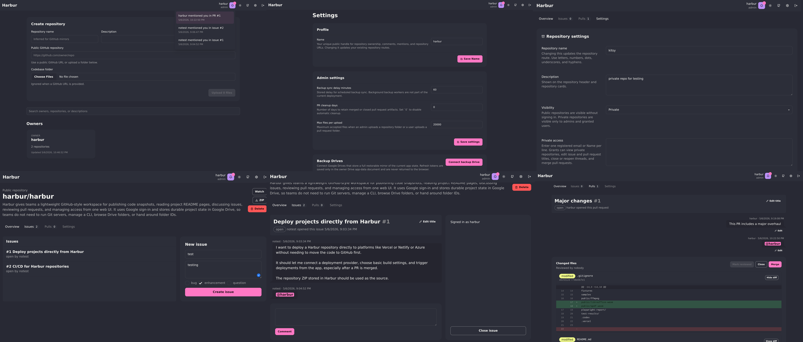
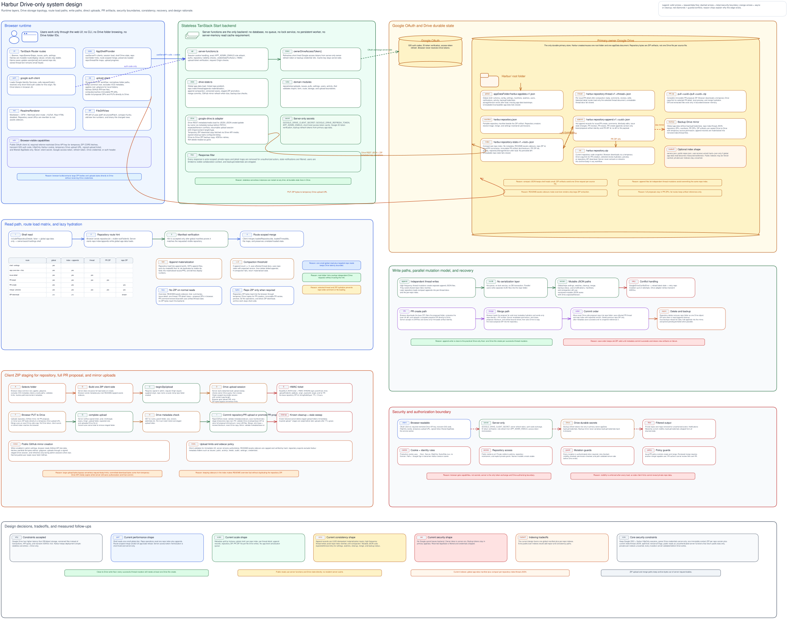
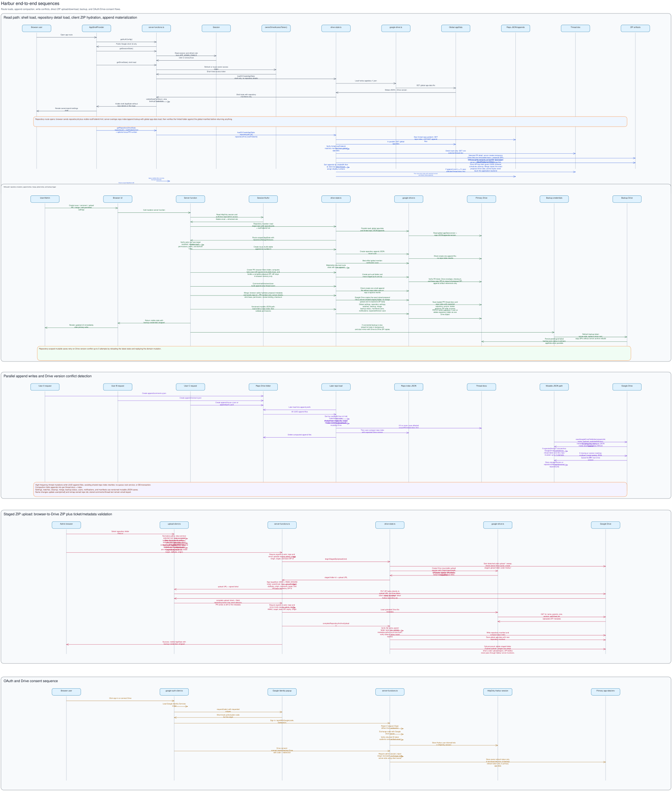

# Harbur

Harbur is a GitHub-style collaboration workspace suitable for non-technical users with simple download and upload workflows, and it runs stateless and stores its durable data in Google Drive. The idea came during the GitHub outage in 2026. The question was: how usable can repository collaboration feel when the app has no database, no long-running backend, and no private infrastructure beyond a serverless deployment and an owner Drive account.

The result is a small project workspace for publishing code snapshots, reading README pages, discussing issues, reviewing pull requests, and managing access from one web UI. It is not meant to replace GitHub or native Git hosting. Instead, it reduces some Git workflow friction for small teams and personal projects by treating repositories as portable ZIP snapshots and routing code changes through pull requests. PR review is current-state based: maintainers inspect the change against the repository as it exists now, test the downloadable merged ZIP if needed, and merge it without a separate Git-style conflict model.

Projects can start from a local folder upload or a public GitHub mirror. Visitors can read README pages and download repository ZIPs without signing in; PR detail pages can build a downloadable merged ZIP for testing before merge. When a PR is merged, Harbur keeps a full pre-merge repository ZIP by copying the previous repository ZIP inside Google Drive, so maintainers can download the exact version from before that merge later. Authenticated contributors can open issues and pull requests, review compact PR diff hunks with line numbers, comment with mentions, watch activity, and merge changes.

The Drive-backed design avoids putting large mutable state in one shared file. High-activity collaboration events such as comments, reviews, issue updates, and PR changes are written as append-style records and later folded into compact indexes and thread documents. This avoids large blocking writes even without request serialization or a database. README sidecars, repository indexes, compact PR change metadata, and optional backup Drive mirrors keep the app usable while still accepting Google Drive's speed and API limits.

Teams that need their own repository publishing space without managing their own infra can host Harbur on free or low-cost serverless platforms and configure their own owner Drive. This can also be used to avoid a single point of failure with drive backups and GitHub mirrors.

The design keeps hosting simple: the app has no database or persistent server process, repositories are stored as portable ZIP snapshots plus small Drive JSON files with structured collaboration metadata, and optional backup Drives can hold a restorable mirror. Only global control state and Drive credentials stay in Drive app-data; repository manifests, per-user state, repository state, and thread append records live as normal Drive files under the app root or beside each repository. Google Drive credentials and refresh tokens stay server-side or inside Drive app-data, never in browser-readable storage.



## User Workflows

| Workflow | Entry Point | Primary Actions |
| --- | --- | --- |
| Sign in | Header | Google Identity Services returns a short-lived authorization code; the server exchanges it, verifies the returned identity token, and creates Harbur's long-lived HttpOnly session cookie |
| Search repositories | `/` | Load Harbur Drive config from server functions, read visible repository manifests, and fuzzy-search by owner, repository name, description, labels, or GitHub URL |
| Browse owners | `/` | List public or accessible owners; owner cards open `/$owner` |
| Browse owner repositories | `/$owner` | Show repositories owned by a mutable Name |
| Open repository | `/repo/$owner/$repo` | Render the root README with GitHub-flavored Markdown, Mermaid, KaTeX, and repository asset support. Public repository pages, issues, pull requests, and ZIP downloads are readable without sign-in; mutating actions require authentication and policy permission |
| Create repository | Admin upload on `/` | Select a local folder or enter a public GitHub repository URL. Folder uploads are filtered, counted, hashed, and zipped by the browser with the shared ZIP adapter. GitHub mirror files are fetched through GitHub's CORS-readable API/raw endpoints and packed by the browser. Both paths show browser preparation/ZIP/upload progress, upload directly to an origin-bound server-created Drive resumable upload session, then commit only after signed ticket, Drive file metadata, path, count, size, hash metadata, and sidecar-content validation |
| Delete repository | Admin repository page | Delete the repository folder from Drive and remove the repository, issues, PRs, notifications, watches, and activity from Harbur state |
| Download ZIP | Repository download button or `/api/repo/$owner/$repo/archive.zip` | Authorize visibility, create a temporary link-readable Drive copy of the stored repository ZIP, fetch or redirect to the Drive API media endpoint with a restricted browser API key, schedule cleanup of the temporary copy after the intended fetch or redirect starts, and rely on stale-download sweeps only for missed cleanup |
| Create issue | Issue form | Validate labels and body, write one repository append record, emit repository activity, and deliver mention or watched-activity notification records to affected user state |
| Comment or close issue | Issue detail page | Append comments, linkify plain `http://` and `https://` URLs, highlight mentions, apply issue state transitions with ownership checks, and deliver affected notification records |
| Open PR | PR frontend folder upload | Download the current repository ZIP through a temporary Drive API media copy, filter the uploaded folder in the browser, compute the diff locally for UX, upload one compact changed-file ZIP directly to Drive with the shared signed resumable-upload flow, and commit compact PR change metadata only if the ticket still matches the current repository ZIP id |
| Review PR diff | PR detail page | Render the proposed change against the current repository state, not the state from when the PR was created, with file-level added/modified/deleted status, content fingerprints, per-file hide/show controls, and compact diff hunks with old/new line numbers |
| Download merged PR ZIP | PR detail page | Download the current repository ZIP plus the selected PR ZIP through temporary Drive API media copies, build the merged ZIP in the browser for testing, and do not mutate Drive state |
| Merge PR | PR detail page | Enforce merge permissions and review policy, copy the current repository ZIP inside Drive as the PR's pre-merge ZIP, build the merged repository ZIP in the browser, upload it through a signed staged resumable upload pinned to the current repository ZIP id, save the repository index/thread state, delete the previous repository ZIP artifact, emit activity, and deliver watched-activity notification records. The pre-merge ZIP download button appears on the PR detail page only after merge |
| Watch repo | Watch control on a repository | Store per-user watch state so subsequent repository activity is delivered as read activity items in notifications |
| Configure repo settings | `/repo/$owner/$repo/settings` | Repository owner sets public/private visibility, issue/PR policy, and private access grants by registered email or unique Name. Private grants can access private repositories, merge PRs, edit issue/PR titles, and close or reopen issues/PRs, but cannot change repository settings |
| Notifications | Header bell | Show per-user mention notifications and watched repository activity records in a dropdown without loading repository append state. Each item opens the related issue, PR, or repository and marks unread mentions as read |
| Settings | `/settings` | User Name settings for authenticated users, plus admin-only GitHub mirror, GitHub mirror interval hours, new repository defaults, PR auto-clean days, backup interval hours, temporary ZIP download cleanup delay, max-files upload limit, owner Drive connection, and backup Drive controls. Admins can disconnect a backup without deleting the remote mirror, or delete the app-created backup mirror and then disconnect |

## Routes

| Route | Purpose |
| --- | --- |
| `/` | Owner directory, repository search, and admin repository upload |
| `/$owner` | Repositories owned by an owner Name |
| `/repo/$owner/$repo` | Repository overview and README rendering |
| `/repo/$owner/$repo/issues` | Issue list and creation |
| `/repo/$owner/$repo/issues/$number` | Issue detail, comments, close/reopen |
| `/repo/$owner/$repo/pulls` | Pull request list |
| `/repo/$owner/$repo/pulls/new` | PR folder upload flow |
| `/repo/$owner/$repo/pulls/$number` | PR detail, diff, comments, review, close, merge |
| `/repo/$owner/$repo/settings` | Repository access and policy settings for the repository owner |
| `/settings` | User Name settings plus admin-only operational and backup settings |
| `/api/repo/$owner/$repo/archive.zip` | GET endpoint for repository ZIP downloads. Public repositories work without sign-in; private repositories require a valid Harbur session cookie. The endpoint redirects to a temporary Drive API media copy instead of proxying ZIP bytes through the server |

Public repository archives can be downloaded with `curl -L -H "Referer: $HARBUR_URL/" "$HARBUR_URL/api/repo/$owner/$repo/archive.zip" -o "$repo.zip"`. The redirected Drive media URL already includes Harbur's configured browser API key; the referrer header is required when that key is HTTP-referrer restricted.

Names are mutable route/display values. Changing a Name remaps owned repository routes and owner pages, and updates display and mention resolution for that email. Email addresses remain the stable user identifiers for authors, maintainers, comments, reviews, settings updates, watch state, and activity; stored thread text is not rewritten.

## Module Map

| Path | Purpose |
| --- | --- |
| `src/routes/__root.tsx` | Root document, metadata, app shell mounting. Must not register a service worker. |
| `src/routes/index.tsx` | Owner discovery, repository search, and admin repository upload. |
| `src/routes/$owner.tsx` | Owner repository list. |
| `src/routes/repo.$owner.$repo*.tsx` | Repository route files that select overview, issues, PR, PR creation, PR detail, and repository settings views. |
| `src/routes/settings.tsx` | User profile settings, admin operational settings, owner Drive connection, and backup Drive controls. |
| `src/components/AppShellProvider.tsx` | Client app shell context. It loads auth/session state, loads shell Drive state including per-user notifications, loads repository detail on demand, merges route-scoped state responses, prepares browser uploads, and calls server functions. |
| `src/components/app-pages/` | Route-facing page modules for repository overview, issues, PRs, settings, loading states, thread UI, and file diffs. |
| `src/components/app-pages/FileDiffView.tsx` | PR file diff rendering. It uses `diff`/jsdiff `structuredPatch` for hunk generation and keeps binary files as a "Binary file changed" row. |
| `src/components/LinkifiedText.tsx` | Shared plain-text URL renderer for `http://` and `https://` links in repository descriptions and issue/PR messages. |
| `src/components/ReadmeRenderer.tsx` | README Markdown rendering with GFM, Mermaid, KaTeX, raw HTML disabled, and repository asset URL rewriting. |
| `src/components/RepositoryCard.tsx` | Repository list card used by owner and search surfaces. Repository description links stay independently clickable without nesting anchors inside the card route link. |
| `src/lib/google-auth-client.ts` | Browser Google Identity Services loader and authorization-code popup helper for sign-in, owner Drive connection, and backup Drive connection. It never receives Drive tokens. |
| `src/lib/server-functions.ts` | TanStack Start server functions for sessions, authorization, owner Drive access, backup Drive token exchange, repositories, issues, PRs, notification read-state updates, settings, and downloads. |
| `src/lib/drive-state.ts` | Drive-backed application state coordinator. It loads and saves the global app-data document, repository manifest files, per-user state JSON, per-repository index JSON, per-thread issue/PR JSON, append-only thread records, ZIP artifacts, backup sync status, and domain operations. |
| `src/lib/google-drive.ts` | Server-side Google Drive API adapter using owner access tokens supplied by server functions. |
| `src/lib/client-zip-workflows.ts` | Shared browser ZIP workflow for repository creation, GitHub mirror creation/sync, PR creation, merge ZIP replacement, cached ZIP hydration, merged PR preview ZIP synthesis, quota checks, and signed staged Drive uploads. |
| `src/lib/drive-quota.ts` | Shared owner Drive quota parsing, formatting, header/settings display helpers, and client-side upload preflight checks with safety margin. |
| `src/lib/github.ts` | Browser-side public GitHub repository lookup plus tree/raw file fetch for mirror creation and due mirror refresh. |
| `src/lib/upload-client.ts` | Browser folder filtering, accepted-file counting, client-side ZIP creation, repository ZIP extraction, direct Drive upload-session transfer, and upload progress. |
| `src/lib/zip.ts` | Shared browser ZIP adapter for archive creation and extraction used by uploads, PR diffs, merges, merged PR preview ZIP synthesis, GitHub mirrors, and client ZIP hydration. |
| `src/lib/download-client.ts` | Browser download helper for Drive API media ZIP blobs and client-built ZIP blobs. |
| `src/lib/search.ts` | Owner and repository grouping plus fuzzy repository search over visible shell metadata. |
| `src/lib/users.ts` | Owner Name display helpers and email-to-Name replacement for notification and activity text. |
| `src/lib/readme-assets.ts` | README asset path resolution for files under the repository root `assets/` directory. |
| `src/lib/security/paths.ts` | Shared unsafe path and VCS metadata path checks. |
| `src/lib/repositories/` | Manifest creation, repository name rules, upload path normalization, upload validation, content fingerprints, ZIP/download filtering. |
| `src/lib/issues/` | Issue state transitions, labels, comments, ownership checks, mention parsing. |
| `src/lib/pulls/` | PR schemas, folder upload diffing, compact changes, merge guards, and merge application helpers. |
| `src/lib/activity/` | Activity record types shared by Drive state and UI activity feeds. |
| `src/lib/settings/` | Settings schema, defaults, and bootstrap config. |
| `src/styles.css` | Tailwind v4, typography plugin, and daisyUI theme declarations. |
| `vite.config.ts` | TanStack Start, Nitro, TanStack devtools, React, React compiler, Tailwind, and daisyUI Vite wiring. |
| `scripts/export-excalidraw.ts` | TypeScript Excalidraw export script. It finds every `*.excalidraw` file in the repo and writes the matching `assets/<name>.svg` file. |
| `docs/diagrams/*.excalidraw` | Editable architecture diagram sources for the committed README SVGs. |
| `tests/unit/` | Deterministic unit tests for current domain behavior. |

## Data Contracts

Runtime validation uses `zod` at import, form, route, and storage boundaries.

Important settings defaults:

```json
{
  "schema": "harbur.settings.v1",
  "ownerName": "harbur-<random>",
  "allowPublicGitMirrors": false,
  "githubMirrorSyncIntervalHours": 24,
  "defaultRepoVisibility": "public",
  "defaultRepoPolicy": {
    "issuesEnabled": true,
    "prsEnabled": true,
    "allowUserCloseOwnIssues": true,
    "requiredStatusForMerge": "none"
  },
  "prAutoCleanDays": 0,
  "backupSyncIntervalHours": 24,
  "downloadCleanupDelayMs": 0,
  "uploadLimits": {
    "maxRepoUploadBytes": 2147483648,
    "maxPrUploadBytes": 536870912,
    "maxSingleFileBytes": 104857600,
    "maxFilesPerUpload": 20000
  },
  "backupTargets": []
}
```

Repository creation defaults are stored settings. The admin UI exposes public GitHub mirror enablement, GitHub mirror interval hours, default repository visibility, default issue/PR policy for new repositories, PR auto-clean days, backup interval hours, temporary ZIP download cleanup delay milliseconds, `maxFilesPerUpload`, detailed owner Drive usage in settings, and a minimal owner Drive usage indicator in the header.

Repository names must match `^[A-Za-z0-9][A-Za-z0-9._-]{0,99}$`: only letters, numbers, dots, underscores, and hyphens; a leading letter or number; no spaces; maximum length 100 characters.

Operational settings:

| Setting | Behavior |
| --- | --- |
| `githubMirrorSyncIntervalHours` | Limits automatic GitHub mirror refresh to at most once per mirrored repository in that many hours during admin sessions. `0` disables automatic mirror refresh. Normal public/user reads do not trigger GitHub fetches or Drive writes. Public mirror imports use GitHub's unauthenticated API/raw endpoints from the browser, so GitHub public rate limits and tree-size limits can reject very large or high-frequency imports. |
| `prAutoCleanDays` | Deletes pull requests older than the configured number of days the next time their repository state is loaded, including compact PR ZIPs and merged PR pre-merge ZIPs. `0` disables PR auto-clean. |
| `backupSyncIntervalHours` | Limits automatic full backup mirrors to at most once per connected backup Drive in that many hours. `0` disables automatic background backups. Successful mutations opportunistically start a background backup only when a connected Drive is due. |
| `downloadCleanupDelayMs` | Waits this many milliseconds before deleting temporary ZIP download copies after the browser starts the intended media fetch. `0` schedules cleanup without delay. Cleanup tickets and stale-download sweeps include this delay plus the fixed grace window. |
| `uploadLimits` | Browser preflight validates local repository/PR folders for immediate UX. Server-side quota, signed-ticket, Drive metadata, submitted path/count/size/hash metadata, and sidecar validation remain authoritative before commit. |

Backup Drives connected from `/settings` receive a compact restorable mirror: global app-data without backup credentials, per-user state JSON files, repository index/thread JSON files, repository ZIP artifacts, manifests, PR ZIP artifacts, and merged PR pre-merge ZIP artifacts. Append records are materialized into the mirrored index/thread JSON instead of copied as separate append files. A restore is performed by configuring `GOOGLE_DRIVE_REFRESH_TOKEN` for the backup Drive account and starting the app against that mirrored `Harbur/` state.

Implementation constants:

| Area | Value |
| --- | --- |
| App and schema names | App name `Harbur`, slug `harbur`, schemas `harbur.appdata.v1`, `harbur.settings.v1`, `harbur.repository.v1`, `harbur.user-state.v1`, `harbur.repository-state.v1`, `harbur.repository-thread.v1`, and `harbur.repository-append.v1`. |
| Actors and config | Anonymous actor id is `anonymous`, anonymous email is `anonymous@harbur.local`, actor roles are `anonymous`, `user`, and `admin`, repository ids are `<owner>/<name>`, bootstrap config provider is `google-drive`, and app-data version is `1`. |
| Drive filenames | `harbur.appdata.v1.json`, `harbur.user-state.v1.<email-hash>.<safe-email>.json`, `harbur.repository.zip`, `harbur.repository.json`, `harbur.repository-state.v1.<repository-root-folder-id>.json`, `harbur.repository-thread.v1.<repository-root-folder-id>.<thread-id>.json`, and `harbur.repository-append.v1.<repository-root-folder-id>.<append-id>.json`. |
| Staged artifacts | Upload folders use `upload-<uuid>-<label>` and `harbur.upload.zip` for staged non-repository ZIPs. Download folders use `download-<uuid>-<label>`. Labels are lowercased, non `[a-z0-9._-]` characters become `-`, leading/trailing dashes are trimmed, and labels are capped at 80 characters. |
| Sessions and timing | Session cookie names are `harbur_session` in development and `__Host-harbur_session` in production. Harbur session max age is 400 days. Session passwords and ticket HMACs are derived from the server-only `GOOGLE_DRIVE_CLIENT_SECRET`; there is no separate session-secret variable. Slow timing spans log at 1000 ms unless `HARBUR_TIMING=1` logs all spans. |
| Upload staging | ZIP upload tickets expire after 2 hours. Stale upload sweep grace is 1 hour after ticket expiry and deletes at most 10 stale upload folders per sweep. Upload preflight uses a 10 MiB Drive quota safety margin. Browser ZIP compression level is 3. |
| Download staging | Temporary download cleanup delay admin-configurable. Cleanup grace is 1 hour after the configured delay, and stale download sweeps delete at most 10 folders per sweep. |
| Sidecar caps | README root `assets/` sidecars include at most 20 files and 2 MiB total. |
| Append compaction | Repository append compaction runs after at least 5 append records accumulate for a repository load. |
| Drive queries | Exact Drive searches request up to 10 results; prefix searches request up to 1000 results. |
| Activity kinds | Activity records use `repo.created`, `issue.created`, `issue.closed`, `issue.reopened`, `issue.commented`, `pr.created`, `pr.closed`, `pr.commented`, `pr.merged`, `repo.watched`, `repo.deleted`, `repo.synced`, and `settings.updated`. |

Validation and content contracts:

- Browser folder uploads strip a common selected root folder, apply only the root `.gitignore`, exclude VCS metadata paths, reject unsafe paths, reject duplicate normalized paths, enforce configured file/count/byte limits, and build one ZIP.
- Unsafe paths are empty paths, paths escaping through `..`, paths containing NUL bytes, and paths that normalize differently after slash normalization. Blocked VCS path segments are `.git`, `.hg`, `.svn`, `_FOSSIL_`, `.fslckout`, `.fossil-settings`, and `CVS`.
- Repository exports also exclude Harbur metadata path segments: `issues`, `pulls`, `activity`, `feeds`, `audit`, `settings`, and `credentials`.
- When repository file content is stored in JSON sidecars or thread documents, it is stored as UTF-8 text when it decodes cleanly and contains no NUL bytes; otherwise it is stored as base64 with `encoding: "base64"`.
- Content hashes use 32-bit FNV-1a over file bytes, rendered as an 8-character lowercase hex string.
- PR display diffs are generated by the browser from repository ZIP bytes, compact PR ZIP bytes, and a small PR change manifest; the rendered diff itself is not a security boundary and should not be stored as authoritative Drive state. The durable PR manifest records the base repository ZIP id, added/modified file metadata and hashes, the compact PR ZIP id, and explicit deleted paths with base hashes. The client may cache generated diffs by PR id, current/base repository ZIP id, and PR ZIP id, but it must recompute when the repository ZIP reference changes.
- Deleted-file intent is treated as explicit PR content rather than trusted UI output. A deleted path that also appears in the compact PR ZIP is invalid, because the PR cannot both delete and upload the same path. A locally removed file that is omitted from `deletedPaths` is not deleted by the PR. A malicious extra deleted path is a visible deletion proposal, not a hidden side effect, and can merge only through normal review/merge permission. Unsafe paths, paths absent from the pinned base repository metadata, or deleted paths whose submitted base hash does not match the pinned base metadata are rejected.
- Mention resolution checks registered user Names using exact, dashed-space, compact-space, and sanitized lowercase handle aliases, and supports self-mentions.
- Upload tickets and download cleanup tickets are base64url JSON payloads signed with HMAC-SHA256 using the server session secret. Verification uses timing-safe signature comparison, expiry checks, and request-origin checks.
- ZIP upload tickets are discriminated by `repository`, `pull-request`, `pull-merge`, or `github-mirror-sync`. Repository tickets bind actor email, owner, repository name, upload folder id, ZIP byte size, origin, and expiry. PR, merge, and mirror-sync tickets also bind repository id, repository root-folder id, base repository ZIP id, and, for merge, the PR number.
- Completion calls never send ZIP bodies to server functions. They send the uploaded Drive file id, signed ticket, and submitted path/count/size/hash metadata; the server verifies Drive parent/name/byte-size metadata, quota, permissions, base ZIP id pins, and submitted metadata before committing state.
- Temporary download copies get a Drive `anyone`/`reader` permission with `allowFileDiscovery: false`. Browser ZIP fetches use `https://www.googleapis.com/drive/v3/files/<file-id>?alt=media&acknowledgeAbuse=true&key=<browser-api-key>`, then submit the signed cleanup ticket.

Stored document shapes:

| Document | Durable fields |
| --- | --- |
| Global app-data | `schema`, `config`, `settings`, `rootFolder`, global activity, and backup credentials. Runtime-only loaded repository/thread/file ids and storage versions are added after load and are not required in the stored document. Repository manifests and user state are loaded only from their split normal-Drive JSON documents. |
| User state | `schema`, normalized `email`, `profile`, watched repository ids, and notifications for that email. Saving a watch, marking notifications read, creating a missing profile, or delivering mention/watched-activity notifications writes only the affected user JSON document. Header notifications treat this document as the authoritative source. |
| User profile | `email`, mutable `ownerName`, `createdAt`, and `updatedAt`. |
| Notification | `id`, `repositoryId`, `recipientEmail`, `actorEmail`, `kind` (`mention` or `activity`), `sourceId`, optional `sourceKind` (`repository`, `issue`, or `pull`), optional `sourceNumber`, `message`, `createdAt`, and `read`. Mention notifications are unread until marked read; watched-activity notifications are stored as already read notification items. |
| Repository manifest | `schema`, `id`, `owner`, `name`, optional `description`, `defaultBranch`, `vcs`, `visibility`, `rootFolderId`, `policy`, `maintainers`, private `access` grants, optional `githubMirror`, labels, `archived`, `createdAt`, and `updatedAt`. |
| Repository index | `schema`, `repositoryId`, content-free repository file metadata, README/assets sidecar files with content, current repository ZIP id, issue summaries with empty comments, PR summaries with empty comments plus PR change manifests, PR ZIP id maps, merged PR pre-merge ZIP id map, and repository activity. |
| Thread document | `schema`, `repositoryId`, `kind` (`issue` or `pull`), and the full issue or PR thread with body, comments, reviews, edits, and selected sidecar content. |
| Append record | `schema`, UUID `id`, `repositoryId`, `createdAt`, append `kind`, the kind-specific payload, and emitted activity. Append records do not drive header notification reads; notification records are written to per-user state. Append kinds are `issue.created`, `pull.created`, `issue.commented`, `issue.title.edited`, `issue.message.edited`, `issue.state.changed`, `pull.commented`, `pull.title.edited`, `pull.message.edited`, `pull.reviewed`, and `pull.closed`. |

Repository policy is stored on each repository manifest and can be changed from `/repo/$owner/$repo/settings` by users with `settings` maintainer permission. Admin settings only define the default policy copied into newly created repositories. The active per-repository policy contains exactly these enforced controls:

| Field | Effect |
| --- | --- |
| `issuesEnabled` | Allows or blocks new issue creation and issue state changes. Existing issues remain readable and commentable to signed-in users who can see the repository. |
| `prsEnabled` | Allows or blocks new PR creation and merge. Existing PRs remain readable, commentable, and reviewable to signed-in users who can see the repository. |
| `allowUserCloseOwnIssues` | Allows issue authors to close or reopen their own issues without maintainer triage permission. |
| `requiredStatusForMerge` | `none` allows direct merge by merge-capable users. `reviewed` requires another merge-capable user to click "Mark reviewed" before merge. |

Fixed collaboration rules intentionally remain code-level product behavior rather than stored policy: signed-in users who can see a repository can comment on existing issues and PRs; PR authors can close their own PRs; PR authors cannot mark their own PR reviewed; private access grants can merge, review, close or reopen threads, and edit issue/PR titles but cannot change repository settings; new repository creators receive `triage`, `merge`, and `settings`; new repositories start with `main` as the default branch and built-in `bug`, `enhancement`, and `question` labels.

Drive storage layout:

| Drive Area | File or Folder | Contents |
| --- | --- | --- |
| Owner Drive root folder | `Harbur/` | App-created parent folder for Harbur repository folders. Repository and PR ZIP artifacts live inside those folders. |
| Owner Drive `appDataFolder` | `harbur.appdata.v1.json` | Global control state: schema, config, settings, root folder metadata, non-repository activity, backup credentials, and runtime-only `storageVersion` after load. |
| Owner Drive root folder | `harbur.user-state.v1.<email-hash>.<safe-email>.json` | Per-user state: user profile/Name, watched repository ids, notifications, and runtime-only user document version after load. |
| Repository folder | `harbur.repository.zip` | Current repository code snapshot as one ZIP artifact. |
| Repository folder | `harbur.repository.json` | Portable repository manifest beside the ZIP artifact. The repository registry is loaded by scanning repository folders under `Harbur/` for this manifest instead of rewriting global app-data for each repository create/settings change. |
| Repository folder | `harbur.repository-state.v1.<repository-root-folder-id>.json` | Per-repository index state: repository file metadata, root README plus capped root `assets/` image sidecars, current repository ZIP id, issue/PR summaries, compact PR change manifests, PR ZIP ids, merged PR pre-merge ZIP ids, repository activity, and runtime-only repository document version after load. Full repository file contents, PR changed-file contents, compacted thread comment bodies, and rendered PR diffs are not stored in this JSON. |
| Repository folder | `harbur.repository-thread.v1.<repository-root-folder-id>.<thread-id>.json` | Per-issue or per-PR detail document written by append compaction and mutable repo saves. Selected issue/PR detail routes load only the requested thread document instead of every thread body/comment in the repository. |
| Repository folder | `harbur.repository-append.v1.<repository-root-folder-id>.<append-id>.json` | Append-only thread records for issue/PR creation, comments, message/title edits, issue state changes, PR reviews, and PR closes. PR create records store compact PR change metadata and the PR ZIP id, not changed-file contents or rendered diffs. Concurrent actions write separate files, and repository loads materialize final issue/PR state from the repo index, selected thread docs, and append records. When enough append records accumulate, the loader folds them into the affected thread docs and repository index, then deletes the compacted append files. |
| PR folder | `pull-<uuid>/pull-<uuid>.zip` | Compact PR upload ZIP containing changed files for that pull request. The display PR number is assigned during repository state materialization, not used as the Drive artifact identity. |
| Repository folder | `pull-<uuid>-pre-merge.zip` | Full repository ZIP copied Drive-to-Drive during merge before the repository ZIP is replaced. It is available from the merged PR detail page as "Pre-merge ZIP" and is deleted with that PR by opportunistic PR auto-clean. |
| Staged upload folder | `upload-<uuid>-<label>/` | Temporary browser-to-Drive ZIP upload folder under `Harbur/`. Repository upload stages contain `harbur.repository.zip`; during commit, the same folder id is renamed to the repository folder label and promoted into the repository manifest as the repository root. PR upload stages contain the browser-built compact changed-file `harbur.upload.zip`; completion moves that ZIP under the target repository, appends the PR create record, and deletes the stage folder. Merge upload stages contain the browser-built merged `harbur.repository.zip`; completion moves that ZIP under the target repository, updates repository metadata, and deletes the stage folder. |
| Staged download folder | `download-<uuid>-<label>/` | Temporary ZIP download folder under `Harbur/`. The server copies a committed repository ZIP, compact PR ZIP, or stored pre-merge ZIP into this folder, grants link-readable access to that copy only, returns a Drive API media URL plus a signed cleanup ticket, and the browser schedules cleanup after the configured delay once it starts the intended media fetch. Later stale-download sweeps delete old folders if browser cleanup was missed. |
| Backup Drive root folder | `Harbur/` mirror | Compact restorable mirror of global app data without backup credentials, per-user state files, repository index/thread files, repository ZIPs, manifests, PR ZIPs, and merged PR pre-merge ZIPs. ZIP artifacts are copied Drive-to-Drive with temporary source permissions rather than rebuilt on the server. Append records are folded into mirrored index/thread files. |

The server returns only a filtered `AppState` to the browser. `backupCredentials` are stripped before serialization, private repositories are removed for unauthorized actors, stale notifications for repositories the actor can no longer see are filtered out, and route-scoped repository responses only include details for repositories explicitly loaded by id.

Existing app-data, user state, repository manifest, repository index, and thread JSON documents fail closed when they are unreadable or incompatible; the app bootstraps only when the owner app-data document is missing.

## Architecture Overview

Harbur uses TanStack Start server functions as the only backend and Google Drive as the only durable store. The browser handles large ZIP creation, extraction, diffing, and merge synthesis; server functions handle identity, authorization, Drive credentials, signed upload/download tickets, quota checks, metadata validation, and final state commits.

Runtime responsibilities:

| Layer | Responsibilities |
| --- | --- |
| Browser UI | Routes, settings forms, repository browsing, README rendering, issue/PR UI, ZIP creation/extraction, PR diff generation, merge ZIP synthesis, GitHub mirror API/raw file fetch and ZIP packing, direct Drive upload PUTs, and Drive API media fetches for temporary ZIP download copies. |
| Server functions | Google code exchange, Harbur session cookies, admin and repository permission checks, owner/backup Drive access tokens, signed upload/download tickets, quota checks, Drive metadata verification, app-data/user/repo-state/thread JSON writes, append compaction, backup triggers, and filtered `AppState` responses. |
| Google Drive | Durable storage for app-data, per-user state, repository manifests, repository ZIPs, compact repository indexes, per-thread documents, append records, staged upload folders, staged download folders, and backup mirrors. |

Design rationale:

- Drive operations are kept small on normal reads. Shell and owner routes use global control state, repository manifest files, and per-user state docs; repository overview and thread detail routes use compact repository indexes, README/assets sidecars, selected thread docs, and repository root-folder hints instead of extracting repository ZIPs.
- High-frequency collaboration writes avoid shared mutable JSON where possible. Issue/PR creates, comments, edits, reviews, closes, and issue state changes write append JSON records first, then repository loads compact those records into per-thread docs and the per-repo index.
- Large archive bytes avoid serverless request-body, memory, and timeout limits. The browser builds, extracts, diffs, and merges ZIPs; uploads go directly to Drive resumable upload URLs; ZIP downloads and PR hydration use temporary Drive API media copies; backup ZIPs copy Drive-to-Drive.
- Security stays server-owned even when bytes move directly between browser and Drive. Server functions keep OAuth secrets and Drive tokens, sign upload/download tickets, check quota and permissions, pin PR/mirror/merge tickets to the base repository ZIP id, validate Drive metadata, and commit state only after those checks pass.
- Staged upload/download folders are not durable Harbur state until validated and committed. Stale staged artifacts are cleaned best-effort, while canonical repository and PR ZIPs remain private.

The canonical storage layout is listed in the Drive storage table above. The architecture summary below focuses on how that state is read, written, and cleaned up.

Read paths:

| Path | Behavior |
| --- | --- |
| Shell load | Server functions load global app-data, scan repository manifest files, load user state docs, filter private repositories and stale notifications for the actor, and return visible shell metadata. |
| Header notifications | Header renders the actor's per-user notification records already included in shell state after server-side visibility filtering, and does not materialize repository indexes or append records. |
| Owner/repository list | Lists use visible manifests and compact repository metadata instead of extracting ZIP artifacts. |
| Repository overview | Reads the repository index README/assets sidecars and renders Markdown without loading the full repository ZIP. |
| Issue/PR detail | Hydrates only the selected thread document plus materialized append state. Selected PR detail fetches the current repository ZIP and compact PR ZIP through temporary Drive copies, then regenerates and caches the rendered diff in the browser. |
| Repository-scoped calls | The browser sends the visible repository root folder id so the server can start repository Drive reads in parallel with global app-data, manifest, and user-state loading, then authorize the result against the loaded manifest before returning data. |

Write and ZIP paths:

| Mutation | Flow |
| --- | --- |
| Repository creation | Browser filters the selected folder, applies root `.gitignore`, excludes VCS metadata, builds the ZIP, sends sidecar/path/count/size/hash metadata, uploads directly to an origin-bound Drive resumable upload URL, then the server validates the signed ticket and Drive metadata before committing manifest/index state. |
| GitHub mirror creation/sync | Browser reads public repository metadata/tree data from GitHub's API, fetches file bytes from GitHub raw/blob endpoints, packs/validates them through the shared ZIP workflow without applying `.gitignore`, uploads through the same staged Drive flow, and commits only when server ticket and base ZIP checks pass. |
| PR creation | Browser downloads the current repo ZIP through a temporary Drive API media copy, computes the display diff locally, builds a compact changed-file PR ZIP, uploads it through a signed staged upload pinned to the current repository ZIP id, and commits only the compact PR change manifest if that base ZIP id still matches. |
| Merge | Browser downloads the current repo ZIP plus compact PR ZIP through temporary Drive API media copies, builds the merged repository ZIP, and uploads it through a signed staged upload pinned to the current repository ZIP id. Before replacing the repository ZIP, the server copies the current repository ZIP inside Drive as that PR's pre-merge ZIP. The server commits only if permissions, review policy, state, and base ZIP id still match. |
| ZIP download / pre-merge ZIP | Server authorizes access, creates a temporary copy of the committed ZIP artifact or stored pre-merge ZIP, grants link-readable access with link discovery disabled on that copy only, and returns a Drive API media URL plus cleanup ticket for browser downloads. The repository archive API route uses the same temporary-copy path but redirects HTTP clients such as `curl` directly to the Drive API media URL instead of proxying ZIP bytes. |
| Backup mirror | Server copies ZIP artifacts Drive-to-Drive with temporary source permissions; append records are materialized into mirrored index/thread JSON instead of copied as separate append files. |

Concurrency and consistency:

- High-frequency thread mutations write separate UUID append JSON files, avoiding shared repository-index rewrites for comments, edits, reviews, closes, and issue state changes.
- Repository loads materialize append records into the repository index plus affected thread documents, then delete compacted append records best-effort.
- Global settings and backup status use versioned app-data saves. Repository settings/manifests use versioned per-repository manifest/index saves. Watches, user profiles, and notification records use versioned per-user JSON saves. Merge and compaction use versioned repository JSON saves with retry or best-effort cleanup where appropriate.
- PR creation, merge, and GitHub mirror sync tickets are pinned to the repository ZIP id used by the browser as its base snapshot, so stale browser-generated diffs or merged ZIPs are rejected if the repository changed before commit.
- Repository, issue, PR, watch, settings, backup, merge, and GitHub mirror mutations append activity records in Drive state for repository feeds. Mutations that affect watched repositories also write read activity notification records into each watcher user-state document; header notifications do not reconstruct watched activity from append records on read.
- Repository deletion deletes the repository folder as one Drive object and removes the repository, issues, PRs, notifications, watches, and activity from Harbur state.

Cleanup and recovery:

- Abandoned `upload-*` folders are not considered repositories, PRs, mirror syncs, or merges unless the server validates the signed ticket, Drive metadata, submitted metadata, writes the repository manifest or append/index state, and commits the mutation. A detached stale-upload sweep runs before new staged upload sessions.
- Temporary `download-*` folders are intended for a single browser media fetch. The browser schedules signed cleanup after the configured delay once the fetch starts, and later download requests sweep stale folders if cleanup was missed.
- Backup sync is opportunistic and interval-gated by persisted backup target timestamps, so stateless serverless instances do not need a resident scheduler.
- Existing app-data, user state, repository manifest, repository index, and thread JSON documents fail closed when unreadable or incompatible; the app bootstraps only when the owner app-data document is missing.

## Architecture Diagrams

The README architecture diagrams are generated SVGs exported from editable Excalidraw source files in `docs/diagrams/`. The low-level design diagram covers storage and runtime internals; the sequence diagram covers read, write, upload, download, OAuth, and backup flows.





Architecture-affecting changes must update the relevant `docs/diagrams/*.excalidraw` source and regenerate committed SVG assets with `npm run diagrams:build`. Do not edit generated `assets/*.svg` architecture diagrams by hand. New diagrams should be added only when they cover a new concern without duplicating the low-level design or sequence diagrams.

## Security Requirements

- Google OAuth client secrets, Google access tokens, refresh tokens, Drive credentials, OAuth codes, and authorization headers are never stored in browser-readable durable storage.
- Google sign-in, owner Drive consent, and backup Drive consent use Google Identity Services popup code flow. The browser receives only a short-lived authorization code for the current origin; the server rejects origin mismatches and exchanges the code with the Google client secret.
- Harbur stores its own long-lived HttpOnly session cookie after Google identity verification. Production cookies use the `__Host-` prefix, `Secure`, `HttpOnly`, `SameSite=Lax`, no `Domain`, and `Path=/`.
- Owner Drive refresh tokens are read only by server functions from server environment variables. Backup Drive refresh tokens are stored only in primary Drive app-data and are never returned to the browser.
- Admin access requires exact email matches from `APP_ADMIN_EMAILS`. Protected server functions refresh the role from that allowlist before authorizing mutations.
- Non-admin authenticated users can edit only their own Name in global settings. Repository creation, repository deletion, owner Drive connection, backup Drive connection, backup deletion, GitHub mirror defaults, upload limits, temporary ZIP download cleanup delay, and global operational defaults are admin-only. Repository settings require `settings` maintainer permission.
- Private repositories, route-scoped repository details, and notifications are filtered server-side by the actor's current visibility. Revoking access also hides stale notifications for that repository.
- Names are unique mutable route/display handles. Email addresses are stable identifiers for authors, maintainers, access grants, comments, reviews, settings updates, watch state, and activity.
- No Google refresh token is serialized into route data, returned `AppState`, server function return values, localStorage, sessionStorage, browser-readable cookies, or rendered HTML.
- Staged ZIP uploads expose only an origin-bound temporary Drive resumable upload URL plus a signed Harbur ticket. The browser never receives a Drive access token, and repository/PR/mirror/merge state commits only after server-side permission, quota, ticket, base ZIP id, Drive metadata, and submitted metadata checks pass.
- ZIP downloads expose only temporary link-readable copies of committed ZIP artifacts, with link discovery disabled on the copy. Canonical repository, PR, and pre-merge ZIPs stay private, and the temporary copy is deleted after the configured cleanup delay once the intended browser media fetch starts. If Drive policy blocks temporary link sharing, the download path fails closed instead of exposing owner credentials.
- Client-submitted rendered PR diffs are not trusted or stored as authoritative state. A modified browser can lie about what it displays; Harbur persists only the compact PR ZIP, base repository ZIP id, changed-file hashes, and validated deleted-path intent needed to reconstruct and merge the change. Review screens regenerate the visible diff from those inputs.
- Repository README rendering disables raw HTML. User-authored Mermaid diagrams run with strict security mode; maintained README architecture diagrams are generated from Excalidraw sources.
- Repository exports must exclude Harbur metadata folders such as `issues/`, `pulls/`, `activity/`, `feeds/`, `audit/`, `settings/`, and `credentials/`.
- The app must not register a service worker.
